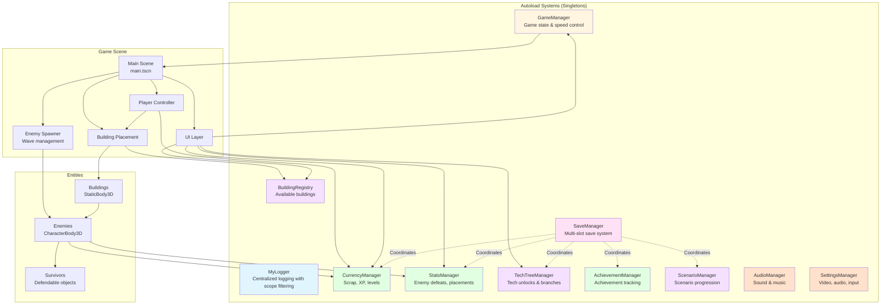
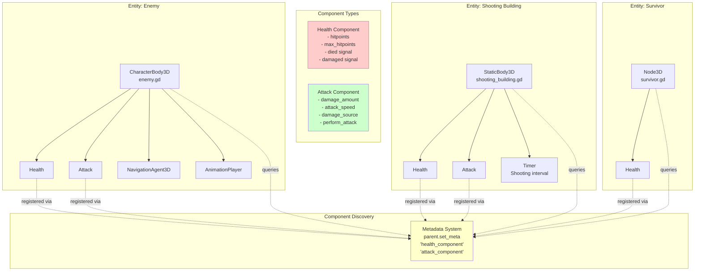
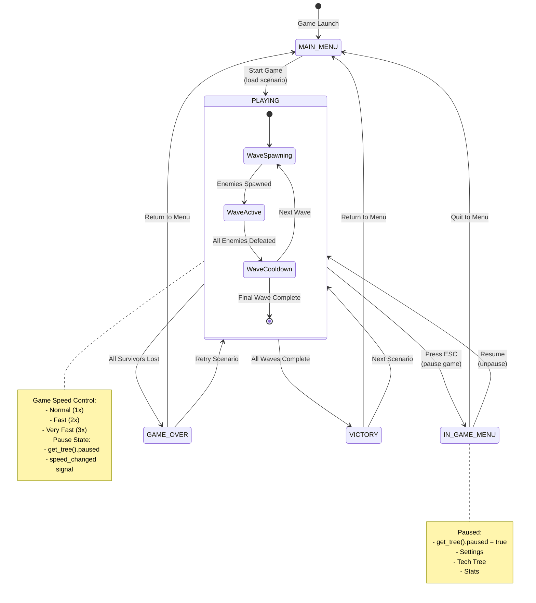
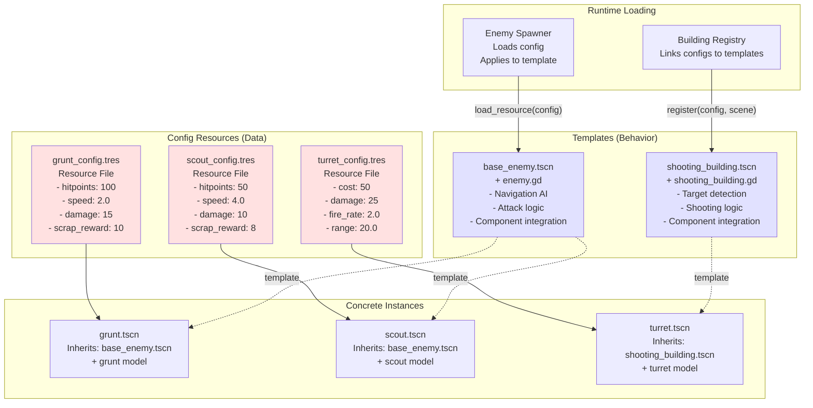
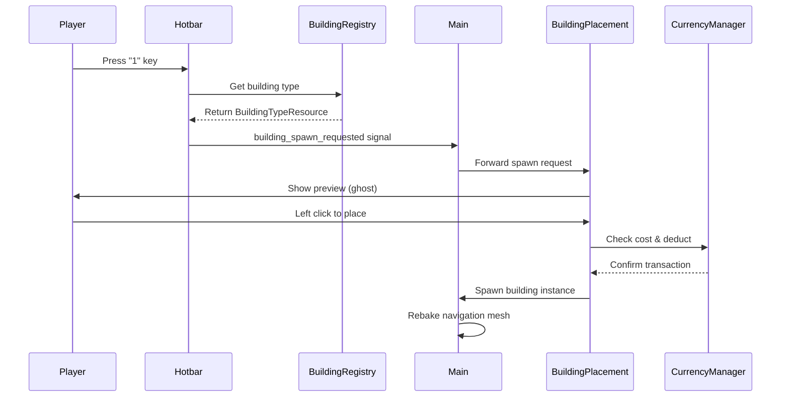
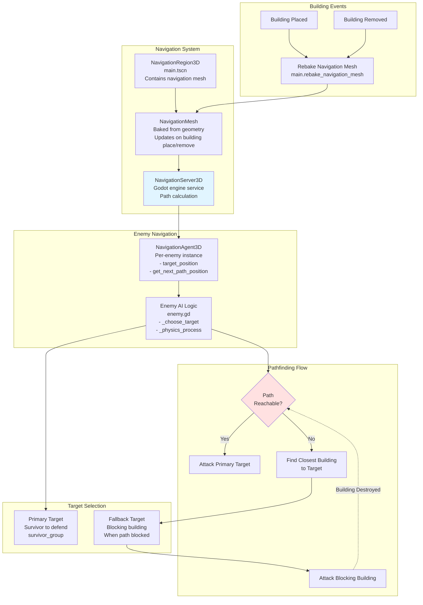

# Zom Nom Defense - Architecture Documentation

> **Domain terminology:** See [`docs/UBIQUITOUS_LANGUAGE.md`](UBIQUITOUS_LANGUAGE.md) for canonical names used in code and documentation.

This document provides comprehensive architecture diagrams for the Zom Nom Defense project using Mermaid diagrams.

## Table of Contents
- [System Architecture](#system-architecture)
- [Component-Based Entity Architecture](#component-based-entity-architecture)
- [Save System Architecture](#save-system-architecture)
- [Game State & Flow](#game-state--flow)
- [Entity Template + Config Pattern](#entity-template--config-pattern)
- [UI Architecture](#ui-architecture)
- [Navigation & Pathfinding](#navigation--pathfinding)

---

## System Architecture

The game uses several autoloaded singleton systems for global state management and coordination.



**Color Legend:**
- 🔵 **Blue** - Debugging/Infrastructure systems (MyLogger)
- 🩷 **Pink** - Persistence/Save systems (SaveManager)
- 🟢 **Green** - Economy/Progression systems (CurrencyManager, StatsManager, AchievementManager)
- 🟡 **Yellow** - Game State Management (GameManager)
- 🟣 **Purple** - Content Management systems (BuildingRegistry, TechTreeManager, ScenarioManager)
- 🟠 **Orange** - Audio/Settings systems (AudioManager, SettingsManager)

---

## Component-Based Entity Architecture

Entities use a composition pattern with reusable components attached as child nodes.



---

## Save System Architecture

The centralized save system uses a SaveableSystem interface pattern for coordinating persistence across all game systems.

```mermaid
graph TB
    subgraph "SaveManager (Orchestrator)"
        SM[SaveManager<br/>Autoload Singleton]
        SaveSlots[Multi-Slot System<br/>10 slots max]
        AutoSave[Auto-Save Timer<br/>Every 5 minutes]
        AtomicWrite[Atomic Writes<br/>temp + rename]
        Backup[Automatic Backups<br/>.save.bak files]
    end
    
    subgraph "SaveableSystem Interface"
        Interface["Interface Methods:<br/>- get_save_key→String<br/>- get_save_data→Dictionary<br/>- load_data Dictionary<br/>- reset_data"]
    end
    
    subgraph "Registered Systems (Per-Slot Data)"
        Currency[CurrencyManager<br/>scrap, XP, level]
        Stats[StatsManager<br/>defeats, placements]
        Tech[TechTreeManager<br/>unlocks, locked branches]
        Achievements[AchievementManager<br/>in-game progress]
        Scenarios[ScenarioManager<br/>completed scenarios, scores]
    end
    
    subgraph "Global Data (Cross-Slot)"
        Settings[SettingsManager<br/>video, audio, input<br/>Separate persistence]
    end
    
    subgraph "Save File Structure"
        SlotFile["user://saves/save_slot_N.save<br/>{<br/>  version: 1,<br/>  metadata: {timestamp, playtime, level},<br/>  currency_manager: {...},<br/>  stats_manager: {...},<br/>  tech_tree_manager: {...},<br/>  achievement_manager: {...},<br/>  scenario_manager: {...}<br/>}"]
        SlotBackup[save_slot_N.save.bak]
    end
    
    SM --> SaveSlots
    SM --> AutoSave
    SM --> AtomicWrite
    SM --> Backup
    
    Interface -.implemented by.-> Currency
    Interface -.implemented by.-> Stats
    Interface -.implemented by.-> Tech
    Interface -.implemented by.-> Achievements
    Interface -.implemented by.-> Levels
    
    SM -.register_system.-> Currency
    SM -.register_system.-> Stats
    SM -.register_system.-> Tech
    SM -.register_system.-> Achievements
    SM -.register_system.-> Levels
    
    SM -- save_current_slot --> SlotFile
    SlotFile -- backup --> SlotBackup
    
    SM -- load_save_slot --> SlotFile
    SlotFile -. recovery .-> SlotBackup
    
    SM -- "create_new_game<br/>(calls reset_data)" --> Currency
    SM -- "create_new_game<br/>(calls reset_data)" --> Stats
    SM -- "create_new_game<br/>(calls reset_data)" --> Tech
    SM -- "create_new_game<br/>(calls reset_data)" --> Achievements
    SM -- "create_new_game<br/>(calls reset_data)" --> Levels
    
    style SM fill:#ffe1f5
    style Interface fill:#e1f5ff
    style SlotFile fill:#f5f5f5
```



**Key Features:**
- **Atomic Writes**: Write to temp file, then rename (prevents corruption)
- **Automatic Backups**: Keep `.bak` files for recovery
- **Per-Slot Reset**: `reset_data()` called on new game
- **Auto-Save**: Every 5 minutes + scenario completion
- **Corruption Recovery**: Falls back to backup if primary corrupted

---

## Game State & Flow

The GameManager controls high-level game state transitions and coordination.



**GameManager API:**
```gdscript
# State Management
GameManager.set_game_state(GameState.PLAYING)
GameManager.current_state

# Pause Control
GameManager.pause_game()
GameManager.resume_game()
GameManager.toggle_pause()
GameManager.is_paused()

# Speed Control
GameManager.set_game_speed(2.0)  # 2x speed
GameManager.get_game_speed()

# Signals
GameManager.game_state_changed.connect(callback)
GameManager.speed_changed.connect(callback)
```

---

## Entity Template + Config Pattern

Game entities use a data-driven architecture separating behavior (templates) from data (configs).



**File Structure:**
```
Config/Enemies/
├── grunt_config.tres
└── scout_config.tres

Entities/Enemies/
├── Templates/base_enemy/
│   ├── base_enemy.tscn
│   └── enemy.gd
└── Concrete/
    ├── grunt/
    │   └── grunt.tscn (inherits base_enemy.tscn)
    └── scout/
        └── scout.tscn (inherits base_enemy.tscn)
```

**Benefits:**
- **Designer-Friendly**: Non-programmers can edit `.tres` files
- **Reusable**: One template, many configurations
- **Maintainable**: Behavior changes in one place
- **Data-Driven**: Easy to balance and iterate

---

## UI Architecture

The UI layer connects to game systems and provides player feedback and controls.

```mermaid
graph TB
    subgraph "Main UI (ui.tscn)"
        MainUI[UI Root<br/>Control Node]
        
        Hotbar[Hotbar<br/>Building selection<br/>1-9 keys]
        
        CurrencyDisplay[Currency Display<br/>Scrap & Level]
        
        StatsDisplay[Stats Display<br/>Enemies defeated<br/>Buildings placed<br/>Toggle: T key]
        
        SpeedControls[Speed Controls<br/>1x, 2x, 3x<br/>Shift+, / Shift-]
        
        Minimap[Minimap<br/>Top-down view<br/>Enemy positions]
        
        SpawnIndicator[Spawn Indicator<br/>Wave countdown<br/>Remaining enemies]
        
        OffscreenIndicator[Offscreen Indicator<br/>Arrows to enemies<br/>Out of view]
    end
    
    subgraph "Menu UI"
        MainMenu[Main Menu<br/>New Game, Continue<br/>Settings, Tech Tree]
        
        PauseMenu[Pause Menu<br/>Resume, Settings<br/>Tech Tree, Quit]
        
        ScenarioSelect[Scenario Select<br/>Available scenarios<br/>Best scores]
        
        TechTree[Tech Tree UI<br/>Unlock tree<br/>Exclusive branches]
        
        Settings[Settings Menu<br/>Video, Audio, Input<br/>Keybind editor]
        
        GameOver[Game Over Menu<br/>Stats, Retry, Quit]
        
        Victory[Victory Menu<br/>Stats, Continue, Quit]
    end
    
    subgraph "Systems"
        GM[GameManager]
        CM[CurrencyManager]
        SM[StatsManager]
        TTM[TechTreeManager]
        OR[BuildingRegistry]
        AM[AudioManager]
        SetM[SettingsManager]
    end
    
    MainUI --> Hotbar
    MainUI --> CurrencyDisplay
    MainUI --> StatsDisplay
    MainUI --> SpeedControls
    MainUI --> Minimap
    MainUI --> SpawnIndicator
    MainUI --> OffscreenIndicator
    
    Hotbar --> OR
    CurrencyDisplay --> CM
    StatsDisplay --> SM
    SpeedControls --> GM
    
    MainMenu --> GM
    MainMenu --> TechTree
    MainMenu --> Settings
    MainMenu --> ScenarioSelect
    
    PauseMenu --> GM
    PauseMenu --> TechTree
    PauseMenu --> Settings
    
    TechTree --> TTM
    Settings --> SetM
    Settings --> AM
    
    GameOver --> SM
    GameOver --> GM
    
    Victory --> SM
    Victory --> GM
    
    style MainUI fill:#e1f5ff
    style MainMenu fill:#ffe1e1
```



**UI Signal Flow:**


---

## Navigation & Pathfinding

The game uses Godot's NavigationServer3D for enemy pathfinding with building avoidance.



**Enemy Pathfinding Logic:**

1. **Target Selection**: Choose primary target from `survivors` group
2. **Path Validation**: Check if path is reachable via `is_target_reachable()`
3. **Fallback**: If blocked, find building closest to target
4. **Attack Priority**:
   - Primary target if in range
   - Fallback building if set and in range
   - Any nearby building within `building_attack_range`
5. **Dynamic Updates**: When building destroyed, recheck path to primary target
6. **Navigation Mesh Rebaking**: After every building placement/removal

**Key Code Reference:**
```gdscript
# In enemy.gd
func _check_and_set_fallback_target() -> void:
  if navigation_agent.is_target_reachable():
    fallback_building_target = null
  else:
    var blocking_building = _find_building_closest_to_target()
    if blocking_building:
      fallback_building_target = blocking_building
      navigation_agent.set_target_position(blocking_building.global_position)

# In main.gd
func rebake_navigation_mesh():
  navigation_region.bake_navigation_mesh()
```

---

## Summary

This architecture provides:

✅ **Modular Systems**: Autoload singletons for clean separation of concerns  
✅ **Component Composition**: Reusable Health/Attack components for entities  
✅ **Data-Driven Design**: Template + Config pattern for easy content creation  
✅ **Robust Persistence**: Centralized save system with atomic writes and backups  
✅ **State Management**: Clear game state transitions and pause control  
✅ **Scalable UI**: Decoupled UI components connected via signals  
✅ **Intelligent Pathfinding**: Dynamic navigation with building avoidance

**Key Architectural Patterns:**
- **Singleton Pattern**: Autoload systems (MyLogger, SaveManager, etc.)
- **Component Pattern**: Health, Attack as reusable components
- **Observer Pattern**: Signals for event communication
- **Strategy Pattern**: SaveableSystem interface for persistence
- **Template Method**: Entity templates with config overrides
- **Facade Pattern**: GameManager simplifies state management

**Development Philosophy:**
- **Minimal Coupling**: Systems communicate via signals and well-defined interfaces
- **Maximum Cohesion**: Related functionality grouped in single systems
- **Data-Driven**: Game content editable by non-programmers
- **Testable**: Clear boundaries enable unit testing
- **Maintainable**: Changes localized to single systems/components

---

## Camera & Ground Boundaries

Each scenario defines its playable boundary (`scenario.gd` exports):

| Export | Default | Meaning |
|---|---|---|
| `boundary_min_x` | `-50` | West edge |
| `boundary_max_x` | `50` | East edge |
| `boundary_min_z` | `-50` | North edge |
| `boundary_max_z` | `50` | South edge |

`camera.gd` clamps its **orbit centre** (the ground-level point the camera looks at) to these bounds after every movement or rotation, then adjusts the camera position to maintain the same offset. This prevents the camera from revealing void areas without causing jarring jumps.

This orbit-centre clamping is currently the only enforcement of the playable area: the camera can never pan the view outside the configured scenario boundaries, even if the ground mesh or other geometry extends further.
When a scenario loads, `main.gd` calls `_configure_boundaries_from_scenario()` to push the scenario's boundary values to `camera.gd`.

---

## Multiple Spawn Areas

`System_EnemySpawner` supports an array of `spawn_areas` (any `MeshInstance3D`). Each enemy spawn randomly selects one area and picks a random position within its AABB.

### Scene Setup

```
EnemySpawner
├── NorthSpawnArea (MeshInstance3D)
├── SouthSpawnArea (MeshInstance3D)
└── EastSpawnArea  (MeshInstance3D)
```

Assign the mesh nodes to the `spawn_areas` array in the Inspector, or programmatically:

```gdscript
spawner.spawn_areas = [$NorthSpawnArea, $SouthSpawnArea, $EastSpawnArea]
```

A single-element array reproduces the original single-spawn-point behaviour. Leaving the array empty falls back to the spawner node's own position.
