# Tech Tree Design

The tree has five branches, each opening at a different player level to stagger the learning curve:

* **Offensive** – Damage-dealing turrets and traps (starter: Scrap Shooter, Player Level 1)
* **Defensive** – Obstacles/walls, path control, debuffs (starter: Stacked Crates, Player Level 1)
* **Click** – Player's manual damage & click perks (entry: Hydraulic Mouse I, Player Level 2)
* **Economy** – Scrap generation/harvest boosts (entry: Scrap Recycler, Player Level 3)
* **Support** – Buff auras, repairs, synergy amplifiers (entry: Overcharger, Player Level 4)

Each branch features **multi-tier upgrade lines** (e.g., Hydraulic Mouse I → II → III) that deepen specialization before branching into mutually exclusive paths.

**Unlock Model:** Nodes require **Player Level (XP)**, a **Scrap cost**, and/or **Achievements** (e.g., *Place 3 defenses*, *Survive 3 waves*). Some nodes are **mutually exclusive** with alternatives. **Scrap costs** are paid from the player's current Scrap balance at the time of unlock. Specific values are to be balanced in a dedicated pass.

**Starting State:** Players begin with **zero techs unlocked** in each save slot. The two level-1 starter nodes (`tur_scrap_shooter`, `ob_crates`) are immediately available to unlock at the start of a new game. Players must actively unlock these before placing those buildings during gameplay. Tech unlocks are **persistent per save slot** and carry forward across all scenarios within that save.

**Scrap Economy:** Unlocking a tech node costs Scrap (defined per node in `scrap_cost`; values TBD). Scrap is also spent **during gameplay** to place instances of unlocked buildings. Placement costs are defined in `BuildingTypeResource`.

---

## 1) Purpose & Scope

Design the complete tech tree with **mutually exclusive branches**, mapping gameplay elements (obstacles, turrets, support, economy, click upgrades) to tech nodes and defining unlock requirements (level, prerequisites, achievements, costs). This spec guides content authoring and UI/UX but does **not** prescribe engine code.

### Goals

* Meaningful choices that change playstyle
* Permanent consequences per run (no mid-run respec)
* Replayability via distinct specializations
* Clear, readable data model (JSON/tres friendly)

### Scope Summary

* **Total Nodes**: 58 (10 Offensive, 10 Defensive, 10 Economy, 9 Support, 12 Click, 7 Advanced)
* **Mutually Exclusive Pairs**: 5 — Boom Barrel/Incendiary Barrage, Cryo Slick/Razor Wire, Megafoundry/Swarm Salvager, Double Tap/Shock Click (T3 and T5 tiers)
* **Branch Completion Gates**: 4 Advanced nodes require full branch mastery
* **Starting State**: Players begin with **no techs unlocked** - must unlock everything through progression
* **Starter Techs**: 2 level-1 nodes (Scrap Shooter, Stacked Crates); Click opens at level 2, Economy at level 3, Support at level 4
* **Max Level Requirement**: 9 (deep Economy/Support nodes and Post-Advanced T7)

### Tech Tree vs Gameplay Economy

* **Tech Tree Unlocking**: Based on player level, Scrap cost, achievements, and prerequisites. Specific `scrap_cost` values will be balanced in a dedicated pass.
* **Gameplay Placement**: Once unlocked in tech tree, buildings become **available to place** during levels. Placing instances **also costs scrap** (defined per building type in `BuildingTypeResource`).

---

## 2) Full Graph

```mermaid
flowchart TD
    classDef starter fill:#4a7c59,stroke:#2d5a3d,color:#fff
    classDef offensive fill:#8b2020,stroke:#5c1010,color:#fff
    classDef defensive fill:#1a4a7c,stroke:#0d2d5c,color:#fff
    classDef economy fill:#7c6a1a,stroke:#5c4a0d,color:#fff
    classDef support fill:#5a1a7c,stroke:#3a0d5c,color:#fff
    classDef clkStyle fill:#1a6a7c,stroke:#0d4a5c,color:#fff
    classDef advanced fill:#2d2d2d,stroke:#888,color:#fff,stroke-width:3px

    subgraph BRANCHES ["Tech Branches"]
        direction LR

    %% OFFENSIVE BRANCH
    subgraph OFF ["Offensive"]
        direction TB
        tur_scrap_shooter["Scrap Shooter T1 - Starter"]
        tur_scrap_shooter2["Scrap Shooter II T2 - +dmg and range"]
        tur_scrap_shooter3["Scrap Shooter III T3 - burst fire"]
        tur_boom_barrel["Boom Barrel T3 - AoE trap"]
        tur_molotov_mortar["Molotov Mortar T4 - fire AoE"]
        tur_incendiary_barrage["Incendiary Barrage T5 - carpet bombs"]
        tur_saw_spitter["Saw Spitter T3 - pierce"]
        tur_blade_storm["Blade Storm T4 - spin AoE"]
        tur_zed_zapper["Zom Zapper T4 - chain lightning"]
        tur_arc_nova["Arc Nova T5 - overload burst"]

        tur_scrap_shooter --> tur_scrap_shooter2
        tur_scrap_shooter2 --> tur_scrap_shooter3
        tur_scrap_shooter2 --> tur_boom_barrel
        tur_boom_barrel --> tur_molotov_mortar
        tur_molotov_mortar --> tur_incendiary_barrage
        tur_scrap_shooter3 --> tur_saw_spitter
        tur_saw_spitter --> tur_blade_storm
        tur_saw_spitter --> tur_zed_zapper
        tur_zed_zapper --> tur_arc_nova
    end

    %% DEFENSIVE BRANCH
    subgraph DEF ["Defensive"]
        direction TB
        ob_crates["Stacked Crates T1 - Starter"]
        ob_reinforced_crates["Reinforced Crates T2 - +HP wall"]
        ob_fortified_wall["Fortified Wall T3 - heavy wall"]
        ob_oil_slick["Oil Slick T2 - slow ground"]
        ob_cryo_slick["Cryo Slick T3 - freeze ground"]
        ob_spike_barricade["Spike Barricade T2 - contact dmg"]
        ob_razor_wire["Razor Wire T3 - DoT on pass"]
        ob_electric_fence["Electric Fence T4 - continuous DoT"]
        ob_zombie_bait["Zombie Bait Sign T3 - path lure"]
        ob_mega_lure["Mega Lure T4 - multi-path lure"]

        ob_crates --> ob_reinforced_crates
        ob_reinforced_crates --> ob_fortified_wall
        ob_crates --> ob_oil_slick
        ob_oil_slick --> ob_cryo_slick
        ob_crates --> ob_spike_barricade
        ob_spike_barricade --> ob_razor_wire
        ob_razor_wire --> ob_electric_fence
        ob_crates --> ob_zombie_bait
        ob_zombie_bait --> ob_mega_lure
    end

    %% ECONOMY BRANCH
    subgraph ECO ["Economy"]
        direction TB
        eco_scrap_recycler["Scrap Recycler T3 - Entry"]
        eco_scrap_recycler2["Scrap Recycler II T4 - +25% rate"]
        eco_scrap_recycler3["Scrap Recycler III T5 - +50% rate"]
        eco_industrial_recycler["Industrial Recycler T5 - bulk income"]
        eco_megafoundry["Megafoundry T6 - double income"]
        eco_drone_salvager["Drone Salvager T5 - auto-harvest"]
        eco_swarm_salvager["Swarm Salvager T6 - multi-drone"]
        eco_harvest_boost["Harvest Boost T4 - +yield nodes"]
        eco_harvest_boost2["Harvest Boost II T5 - +yield x2"]
        eco_death_dividend["Death Dividend T5 - Scrap on kill"]

        eco_scrap_recycler --> eco_scrap_recycler2
        eco_scrap_recycler2 --> eco_scrap_recycler3
        eco_scrap_recycler3 --> eco_industrial_recycler
        eco_industrial_recycler --> eco_megafoundry
        eco_scrap_recycler3 --> eco_drone_salvager
        eco_drone_salvager --> eco_swarm_salvager
        eco_scrap_recycler2 --> eco_harvest_boost
        eco_harvest_boost --> eco_harvest_boost2
        eco_scrap_recycler3 --> eco_death_dividend
    end

    %% SUPPORT BRANCH
    subgraph SUP ["Support"]
        direction TB
        sup_overcharger["Overcharger T4 - +fire rate aura"]
        sup_overcharger2["Overcharger II T5 - wider aura"]
        sup_range_amp["Range Amplifier T5 - +range aura"]
        sup_range_amp2["Range Amp II T6 - +range x2"]
        sup_atk_beacon["Attack Speed Beacon T5 - -cooldown"]
        sup_atk_beacon2["Attack Speed Beacon II T6 - wider"]
        sup_repair_drone["Auto-Repair Drone T6 - repair def"]
        sup_repair_drone2["Auto-Repair Drone II T7 - faster repair"]
        sup_target_painter["Target Painter T6 - mark = +dmg"]

        sup_overcharger --> sup_overcharger2
        sup_overcharger --> sup_range_amp
        sup_range_amp --> sup_range_amp2
        sup_overcharger2 --> sup_atk_beacon
        sup_atk_beacon --> sup_atk_beacon2
        sup_atk_beacon2 --> sup_repair_drone
        sup_repair_drone --> sup_repair_drone2
        sup_range_amp2 --> sup_target_painter
    end

    %% CLICK BRANCH
    subgraph CLK ["Click"]
        direction TB
        clk_hydraulic_mouse["Hydraulic Mouse I T2 - +25% click dmg"]
        clk_hydraulic_mouse2["Hydraulic Mouse II T3 - +50% click dmg"]
        clk_hydraulic_mouse3["Hydraulic Mouse III T4 - +100% click dmg"]
        clk_double_tap["Double Tap T3 - 10% crit x2.0"]
        clk_double_tap2["Double Tap II T4 - 20% crit x2.5"]
        clk_double_tap3["Double Tap III T5 - 30% crit x3 + splash"]
        clk_shock_click["Shock Click T3 - AoE r=3"]
        clk_shock_click2["Shock Click II T4 - AoE r=5"]
        clk_shock_click3["Shock Click III T5 - AoE + chain"]
        clk_recoil_dampener["Recoil Dampener T3 - turret accuracy buff"]
        clk_recoil_dampener2["Recoil Dampener II T4 - wider buff radius"]
        clk_rapid_fingers["Rapid Fingers T4 - -click cooldown"]

        clk_hydraulic_mouse --> clk_hydraulic_mouse2
        clk_hydraulic_mouse2 --> clk_hydraulic_mouse3
        clk_hydraulic_mouse2 --> clk_double_tap
        clk_double_tap --> clk_double_tap2
        clk_double_tap2 --> clk_double_tap3
        clk_hydraulic_mouse2 --> clk_shock_click
        clk_shock_click --> clk_shock_click2
        clk_shock_click2 --> clk_shock_click3
        clk_hydraulic_mouse --> clk_recoil_dampener
        clk_recoil_dampener --> clk_recoil_dampener2
        clk_hydraulic_mouse3 --> clk_rapid_fingers
    end

    end

    tur_boom_barrel x--x tur_incendiary_barrage
    ob_cryo_slick x--x ob_razor_wire
    eco_megafoundry x--x eco_swarm_salvager
    clk_double_tap x--x clk_shock_click
    clk_double_tap3 x--x clk_shock_click3

    %% ADVANCED NODES
    subgraph ADV ["Advanced"]
        direction LR
        adv_experimental_weapons["Experimental Weapons T6 - req: Offensive complete"]
        adv_railgun_mk2["Railgun Mk.II T7 - piercing beam"]
        adv_fortification_mastery["Fortification Mastery T6 - req: Defensive complete"]
        adv_kill_zone2["Kill Zone II T7 - wider lethality"]
        adv_synergy_hub["Synergy Hub T6 - req: Support + Economy complete"]
        adv_overload_grid["Overload Grid T7 - chain buff aura"]
        adv_click_mastery["Click Mastery T6 - req: Click complete"]

        adv_experimental_weapons --> adv_railgun_mk2
        adv_fortification_mastery --> adv_kill_zone2
        adv_synergy_hub --> adv_overload_grid
    end

    BRANCHES --> ADV

    %% BRANCH COMPLETION GATES
    OFF -.->|"Offensive complete"| adv_experimental_weapons
    DEF -.->|"Defensive complete"| adv_fortification_mastery
    SUP -.->|"Support + Economy complete"| adv_synergy_hub
    ECO -.->|"Support + Economy complete"| adv_synergy_hub
    CLK -.->|"Click complete"| adv_click_mastery

    %% CROSS-BRANCH SYNERGIES
    tur_zed_zapper -.->|"enables"| ob_electric_fence
    tur_molotov_mortar -.->|"ignites"| ob_oil_slick

    %% APPLY CLASSES
    class tur_scrap_shooter,ob_crates starter
    class tur_scrap_shooter2,tur_scrap_shooter3,tur_boom_barrel,tur_molotov_mortar,tur_incendiary_barrage,tur_saw_spitter,tur_blade_storm,tur_zed_zapper,tur_arc_nova offensive
    class ob_reinforced_crates,ob_fortified_wall,ob_oil_slick,ob_cryo_slick,ob_spike_barricade,ob_razor_wire,ob_electric_fence,ob_zombie_bait,ob_mega_lure defensive
    class eco_scrap_recycler,eco_scrap_recycler2,eco_scrap_recycler3,eco_industrial_recycler,eco_megafoundry,eco_drone_salvager,eco_swarm_salvager,eco_harvest_boost,eco_harvest_boost2,eco_death_dividend economy
    class sup_overcharger,sup_overcharger2,sup_range_amp,sup_range_amp2,sup_atk_beacon,sup_atk_beacon2,sup_repair_drone,sup_repair_drone2,sup_target_painter support
    class clk_hydraulic_mouse,clk_hydraulic_mouse2,clk_hydraulic_mouse3,clk_double_tap,clk_double_tap2,clk_double_tap3,clk_shock_click,clk_shock_click2,clk_shock_click3,clk_recoil_dampener,clk_recoil_dampener2,clk_rapid_fingers clkStyle
    class adv_experimental_weapons,adv_railgun_mk2,adv_fortification_mastery,adv_kill_zone2,adv_synergy_hub,adv_overload_grid,adv_click_mastery advanced
```

Legend: **T#** = Tier; **x--x** = mutually exclusive pair; **-->** = linear prerequisite; **-.->** = synergy/gate (dashed).

---

## 3) Node Catalog

> **Note:** IDs are lowercase with prefixes: `tur_` (turret), `ob_` (obstacle), `sup_` (support), `eco_` (economy), `clk_` (click), `adv_` (advanced).

### Offensive (10 nodes)

| id | display_name | description | level | prerequisites | achievements | mutually_exclusive_with | branch_name | unlocked_building_ids | requires_branch_completion | notes |
|---|---|---|---:|---|---|---|---|---|---|---|
| `tur_scrap_shooter` | Scrap Shooter | Basic bolt-firing turret. | 1 | [] | [] | [] | Offensive | [turret] | [] | **Starter** |
| `tur_scrap_shooter2` | Scrap Shooter II | Increased damage and range. | 2 | [tur_scrap_shooter] | [] | [] | Offensive | [] | [] | |
| `tur_scrap_shooter3` | Scrap Shooter III | Burst-fire mode. | 3 | [tur_scrap_shooter2] | [] | [] | Offensive | [] | [] | |
| `tur_boom_barrel` | Boom Barrel | One-shot AoE explosive trap. | 3 | [tur_scrap_shooter2] | [ach_place_3] | [tur_incendiary_barrage] | Offensive | [boom_barrel] | [] | |
| `tur_molotov_mortar` | Molotov Mortar | Lobbed fire; ignites Oil Slick. | 4 | [tur_boom_barrel] | [ach_kill_100] | [] | Offensive | [molotov_mortar] | [] | |
| `tur_incendiary_barrage` | Incendiary Barrage | Carpet-bomb fire AoE. | 5 | [tur_molotov_mortar] | [] | [tur_boom_barrel] | Offensive | [incendiary_barrage] | [] | |
| `tur_saw_spitter` | Saw Spitter | High damage, short range, piercing. | 3 | [tur_scrap_shooter3] | [] | [] | Offensive | [saw_spitter] | [] | |
| `tur_blade_storm` | Blade Storm | Spinning AoE saw blades. | 4 | [tur_saw_spitter] | [] | [] | Offensive | [blade_storm] | [] | |
| `tur_zed_zapper` | Zom Zapper | Chains lightning between targets. | 4 | [tur_saw_spitter] | [] | [] | Offensive | [zed_zapper] | [] | ⚠️ **Pending rename:** display name and building ID being renamed from `zed_zapper` → `zom_zapper`; code identifiers not yet updated |
| `tur_arc_nova` | Arc Nova | Overload lightning burst. | 5 | [tur_zed_zapper] | [] | [] | Offensive | [arc_nova] | [] | |

### Defensive (10 nodes)

| id | display_name | description | level | prerequisites | achievements | mutually_exclusive_with | branch_name | unlocked_building_ids | requires_branch_completion | notes |
|---|---|---|---:|---|---|---|---|---|---|---|
| `ob_crates` | Stacked Crates | Simple wall; minor slow on contact. | 1 | [] | [] | [] | Defensive | [wall] | [] | **Starter** |
| `ob_reinforced_crates` | Reinforced Crates | Higher-HP wall. | 2 | [ob_crates] | [] | [] | Defensive | [reinforced_crates] | [] | |
| `ob_fortified_wall` | Fortified Wall | Near-indestructible wall. | 3 | [ob_reinforced_crates] | [] | [] | Defensive | [fortified_wall] | [] | |
| `ob_oil_slick` | Oil Slick | Ground slow; flammable synergy. | 2 | [ob_crates] | [] | [] | Defensive | [oil_slick] | [] | |
| `ob_cryo_slick` | Cryo Slick | Freeze ground. | 3 | [ob_oil_slick] | [] | [ob_razor_wire] | Defensive | [cryo_slick] | [] | |
| `ob_spike_barricade` | Spike Barricade | Blocks and deals contact damage. | 2 | [ob_crates] | [ach_place_3] | [] | Defensive | [spike_barricade] | [] | |
| `ob_razor_wire` | Razor Wire | Passive DoT on pass. | 3 | [ob_spike_barricade] | [] | [ob_cryo_slick] | Defensive | [razor_wire] | [] | |
| `ob_electric_fence` | Electric Fence | Continuous DoT fence; synergy with Zom Zapper. | 4 | [ob_razor_wire] | [ach_survive_3] | [] | Defensive | [electric_fence] | [] | |
| `ob_zombie_bait` | Zombie Bait Sign | Lure that manipulates pathing. | 3 | [ob_crates] | [] | [] | Defensive | [zombie_bait_sign] | [] | ID uses short form (no `_sign` suffix) |
| `ob_mega_lure` | Mega Lure | Multi-path lure. | 4 | [ob_zombie_bait] | [] | [] | Defensive | [mega_lure] | [] | |

### Economy (10 nodes)

| id | display_name | description | level | prerequisites | achievements | mutually_exclusive_with | branch_name | unlocked_building_ids | requires_branch_completion | notes |
|---|---|---|---:|---|---|---|---|---|---|---|
| `eco_scrap_recycler` | Scrap Recycler | Generates Scrap over time. | 3 | [] | [] | [] | Economy | [scrap_recycler] | [] | **Branch entry** |
| `eco_scrap_recycler2` | Scrap Recycler II | +25% passive rate. | 4 | [eco_scrap_recycler] | [] | [] | Economy | [] | [] | |
| `eco_scrap_recycler3` | Scrap Recycler III | +50% passive rate. | 5 | [eco_scrap_recycler2] | [] | [] | Economy | [] | [] | |
| `eco_industrial_recycler` | Industrial Recycler | Bulk passive income generator. | 5 | [eco_scrap_recycler3] | [] | [] | Economy | [industrial_recycler] | [] | |
| `eco_megafoundry` | Megafoundry | Doubles passive income. | 6 | [eco_industrial_recycler] | [] | [eco_swarm_salvager] | Economy | [megafoundry] | [] | |
| `eco_drone_salvager` | Drone Salvager | Sends drones to harvestables. | 5 | [eco_scrap_recycler3] | [] | [] | Economy | [drone_salvager] | [] | |
| `eco_swarm_salvager` | Swarm Salvager | Multiple simultaneous drones. | 6 | [eco_drone_salvager] | [] | [eco_megafoundry] | Economy | [swarm_salvager] | [] | |
| `eco_harvest_boost` | Harvest Boost | +% yield from world nodes. | 4 | [eco_scrap_recycler2] | [] | [] | Economy | [] | [] | |
| `eco_harvest_boost2` | Harvest Boost II | Doubles node yield. | 5 | [eco_harvest_boost] | [] | [] | Economy | [] | [] | |
| `eco_death_dividend` | Death Dividend | Small Scrap reward per kill. | 5 | [eco_scrap_recycler3] | [] | [] | Economy | [] | [] | |

### Support (9 nodes)

| id | display_name | description | level | prerequisites | achievements | mutually_exclusive_with | branch_name | unlocked_building_ids | requires_branch_completion | notes |
|---|---|---|---:|---|---|---|---|---|---|---|
| `sup_overcharger` | Overcharger | Aura: +fire rate to turrets. | 4 | [] | [] | [] | Support | [overcharger] | [] | **Branch entry** |
| `sup_overcharger2` | Overcharger II | Wider fire-rate aura. | 5 | [sup_overcharger] | [] | [] | Support | [] | [] | |
| `sup_range_amp` | Range Amplifier | Aura: +range to turrets. | 5 | [sup_overcharger] | [] | [] | Support | [range_amplifier] | [] | |
| `sup_range_amp2` | Range Amp II | Double range bonus aura. | 6 | [sup_range_amp] | [] | [] | Support | [] | [] | |
| `sup_atk_beacon` | Attack Speed Beacon | Aura: −reload/cooldowns. | 5 | [sup_overcharger2] | [] | [] | Support | [attack_speed_beacon] | [] | |
| `sup_atk_beacon2` | Attack Speed Beacon II | Wider cooldown aura. | 6 | [sup_atk_beacon] | [] | [] | Support | [] | [] | |
| `sup_repair_drone` | Auto-Repair Drone | Repairs nearby defenses. | 6 | [sup_atk_beacon2] | [ach_lose_5_defenses] | [] | Support | [repair_drone] | [] | |
| `sup_repair_drone2` | Auto-Repair Drone II | Faster repair rate. | 7 | [sup_repair_drone] | [] | [] | Support | [] | [] | |
| `sup_target_painter` | Target Painter | Marked enemies take bonus damage. | 6 | [sup_range_amp2] | [] | [] | Support | [target_painter] | [] | |

### Click (12 nodes)

| id | display_name | description | level | prerequisites | achievements | mutually_exclusive_with | `Resource_AttackEffect` | notes |
|---|---|---|---:|---|---|---|---|---|
| `clk_hydraulic_mouse` | Hydraulic Mouse I | +25% click damage. | 2 | [] | [] | [] | `damage_multiplier=1.25` | |
| `clk_hydraulic_mouse2` | Hydraulic Mouse II | +50% click damage. | 3 | [clk_hydraulic_mouse] | [] | [] | `damage_multiplier=1.50` | |
| `clk_hydraulic_mouse3` | Hydraulic Mouse III | +100% click damage. | 4 | [clk_hydraulic_mouse2] | [] | [] | `damage_multiplier=2.00` | |
| `clk_double_tap` | Double Tap | 10% crit chance on clicks, ×2.0 damage. | 3 | [clk_hydraulic_mouse2] | [ach_click_100] | [clk_shock_click] | `crit_chance=0.10, crit_multiplier=2.0` | |
| `clk_double_tap2` | Double Tap II | 20% crit, ×2.5 damage. | 4 | [clk_double_tap] | [] | [] | `crit_chance=0.20, crit_multiplier=2.5` | |
| `clk_double_tap3` | Double Tap III | 30% crit, ×3.0 damage + splash crits. | 5 | [clk_double_tap2] | [] | [clk_shock_click3] | `crit_chance=0.30, crit_multiplier=3.0, crit_applies_to_splash=true` | |
| `clk_shock_click` | Shock Click | Clicks splash in small AoE (r=3). | 3 | [clk_hydraulic_mouse2] | [ach_click_kills_25] | [clk_double_tap] | `aoe_radius=3.0` | |
| `clk_shock_click2` | Shock Click II | Wider AoE (r=5). | 4 | [clk_shock_click] | [] | [] | `aoe_radius=5.0` | |
| `clk_shock_click3` | Shock Click III | AoE + chain lightning (3 hops). | 5 | [clk_shock_click2] | [] | [clk_double_tap3] | `aoe_radius=5.0, chain_enabled=true, chain_radius=4.0, chain_max_hops=3` | |
| `clk_recoil_dampener` | Recoil Dampener | Mitigates nearby turret accuracy penalties while clicking. | 3 | [clk_hydraulic_mouse] | [] | [] | — | |
| `clk_recoil_dampener2` | Recoil Dampener II | Wider turret accuracy buff radius. | 4 | [clk_recoil_dampener] | [] | [] | — | |
| `clk_rapid_fingers` | Rapid Fingers | Reduces click cooldown / input lag. | 4 | [clk_hydraulic_mouse3] | [] | [] | — | |

### Advanced (7 nodes)

| id | display_name | description | level | prerequisites | achievements | mutually_exclusive_with | branch_name | unlocked_building_ids | requires_branch_completion | notes |
|---|---|---|---:|---|---|---|---|---|---|---|
| `adv_experimental_weapons` | Experimental Weapons | Unlocks cutting-edge offensive tech after mastering basic weaponry. | 6 | [] | [ach_kill_500] | [] | Advanced | [railgun_turret, emp_mine] | [Offensive] | |
| `adv_railgun_mk2` | Railgun Mk.II | High-pierce single-target beam. | 7 | [adv_experimental_weapons] | [] | [] | Advanced | [railgun_mk2] | [] | |
| `adv_fortification_mastery` | Fortification Mastery | Advanced defensive structures for veterans of defensive strategy. | 6 | [] | [ach_survive_10] | [] | Advanced | [reinforced_wall, kill_zone] | [Defensive] | |
| `adv_kill_zone2` | Kill Zone II | Wider, higher-damage kill zone. | 7 | [adv_fortification_mastery] | [] | [] | Advanced | [kill_zone_2] | [] | |
| `adv_synergy_hub` | Synergy Hub | Combines economic and support systems for ultimate efficiency. | 6 | [] | [ach_place_50] | [] | Advanced | [power_grid, resource_amplifier] | [Support, Economy] | |
| `adv_overload_grid` | Overload Grid | Chained buff aura across all support buildings. | 7 | [adv_synergy_hub] | [] | [] | Advanced | [overload_grid] | [] | |
| `adv_click_mastery` | Click Mastery | Stacks all unlocked click `AttackEffect` resources via `stack_effect()`. | 6 | [] | [] | [] | Advanced | [] | [Click] | |

---

## 4) Mutually Exclusive Branch Points

* **Offensive:** `tur_boom_barrel` ⟂ `tur_incendiary_barrage` (single-blast trap line **or** sustained carpet-bomb artillery)
* **Defensive:** `ob_cryo_slick` ⟂ `ob_razor_wire` (freeze/CC ground **or** passive DoT attrition)
* **Economy:** `eco_megafoundry` ⟂ `eco_swarm_salvager` (bulk idle income **or** active multi-drone harvest)
* **Click T3:** `clk_double_tap` ⟂ `clk_shock_click` (crit burst **or** AoE control)
* **Click T5:** `clk_double_tap3` ⟂ `clk_shock_click3` (splash crits **or** AoE chain lightning)

> Choosing one locks the other for the duration of the run/save. UI must clearly warn the player.

> **Note on Offensive exclusivity:** The original `tur_boom_barrel` ⟂ `tur_molotov_mortar` pair has been restructured. `tur_molotov_mortar` is now a linear prerequisite of `tur_boom_barrel`. The exclusivity now falls between `tur_boom_barrel` (trap-focused line) and `tur_incendiary_barrage` (artillery-focused terminal).

---

## 5) Unlock Requirements (Model)

Each node defines:

* **`level_requirement`** – Player level threshold (from XP via zombie kills)
* **`scrap_cost`** – Scrap spent at the moment of unlock (values to be balanced in a dedicated pass)
* **`prerequisites`** – Techs that must be unlocked first
* **`achievements`** – Optional gating (e.g., `ach_place_3`, `ach_survive_3`, `ach_kill_100`, `ach_click_100`, `ach_click_kills_25`, `ach_lose_5_defenses`)
* **`branch_name`** – Category/branch identifier (Offensive, Defensive, Economy, Support, Click, Advanced)
* **`unlocked_building_ids`** – Array of building IDs that become available when this tech is unlocked
* **`requires_branch_completion`** – Array of branch names that must be fully completed before this tech unlocks
  - A branch is "fully completed" when all non-Advanced techs in that branch are unlocked
  - Example: `[Offensive]` means all Offensive nodes (excluding mutually exclusive alternatives) must be unlocked
  - Example: `[Support, Economy]` means BOTH branches must be fully completed
  - Advanced tier nodes use this to gate late-game content behind mastery of core branches

> **Note on Cross-Branch Dependencies:** Some nodes have implicit synergies with other branches (e.g., Electric Fence works better with Zom Zapper, Oil Slick ignites with Molotov Mortar). These are design recommendations, not hard prerequisites in the data model. Implement as gameplay synergies rather than unlock gates.

> **Note on Scrap Economy:** Tech tree unlocking costs Scrap (via `scrap_cost`; values TBD). Scrap is also spent **during gameplay** to place instances of unlocked obstacles/turrets. Placement costs are defined in `BuildingTypeResource`, not in the tech tree data.

---

## 6) Balance Notes & Next Steps

* **Progression Model**: Tech unlocks are **persistent per save slot**. Each new save starts with zero unlocked techs, forcing players to unlock even starter techs. This introduces the tech tree mechanic early and creates a sense of progression.
* Tech tree unlocking costs **Scrap** (via `scrap_cost`) in addition to level and achievement gates. This makes Scrap a meaningful resource both for placement during gameplay and for long-term progression. Cost values will be balanced in a dedicated pass.
* Gate high-impact combos behind both **level** and **achievements** (e.g., `ob_electric_fence` requires level 4 + achievement).
* **Advanced T6 nodes** require branch completion; **T7 nodes** require the preceding T6 Advanced node. This creates two distinct late-game tiers.
* Branch completion logic must account for mutually exclusive choices — completing one path of a fork counts toward branch completion.
* Advanced nodes use level requirements 6–7 to reflect their position as late-game unlocks.
* Scrap economy balancing happens in `BuildingTypeResource` placement costs, not in the tech tree.

### Branch Entry Levels

| Player Level | Branches That Open |
|---:|---|
| 1 | Offensive, Defensive (starters) |
| 2 | Click |
| 3 | Economy |
| 4 | Support |
| 8–9 | Advanced T8/T9 nodes (deep Economy + Support chains) |

### Suggested Level Requirements per Tier (within each branch)

Because branches open at different player levels, "Tier" now describes depth within a branch relative to its entry point rather than an absolute player level. Absolute levels must be set during balance passes, but the rough mapping is:

| Branch | Entry Level | +1 depth | +2 depth | +3 depth | +4 depth |
|---|---:|---:|---:|---:|---:|
| Offensive | 1 | 2 | 3 | 4 | 5 |
| Defensive | 1 | 2 | 3 | 4 | — |
| Click | 2 | 3 | 4 | 5 | 6 |
| Economy | 3 | 4 | 5 | 6 | — |
| Support | 4 | 5 | 6 | 7 | — |
| Advanced | 8 | 9 | — | — | — |

### Node Count Summary

| Branch | Nodes |
|---|---:|
| Offensive | 10 |
| Defensive | 10 |
| Economy | 10 |
| Support | 9 |
| Click | 12 |
| Advanced | 7 |
| **Total** | **58** |

---

## 7) AttackEffect Integration (Click Branch)

Click-branch tech nodes carry a `player_attack_effect: Resource_AttackEffect` field. Each tier stacks additively on the player's combined effect via `stack_effect()`. The following `Resource_AttackEffect` `.tres` files must exist in `Config/AttackEffect/`:

| File | Key Fields |
|---|---|
| `tech_hydraulic_mouse.tres` | `damage_multiplier=1.25` |
| `tech_hydraulic_mouse_2.tres` | `damage_multiplier=1.50` |
| `tech_hydraulic_mouse_3.tres` | `damage_multiplier=2.00` |
| `tech_double_tap.tres` | `crit_chance=0.10, crit_multiplier=2.0` |
| `tech_double_tap_2.tres` | `crit_chance=0.20, crit_multiplier=2.5` |
| `tech_double_tap_3.tres` | `crit_chance=0.30, crit_multiplier=3.0, crit_applies_to_splash=true` |
| `tech_shock_click.tres` | `aoe_radius=3.0` |
| `tech_shock_click_2.tres` | `aoe_radius=5.0` |
| `tech_shock_click_3.tres` | `aoe_radius=5.0, chain_enabled=true, chain_radius=4.0, chain_max_hops=3` |

> **Future building attacks:** The same `Resource_AttackEffect` schema can be attached to `BuildingTypeResource` once the building attack pipeline supports it, letting tech-tree unlocks buff turret behaviour (e.g., Zom Zapper gaining more chain hops, Railgun Mk.II receiving a `damage_multiplier` boost from `adv_click_mastery`).

### Building Attack Effect Mappings (planned)

| Tech Unlocked | Affected Building | Proposed Effect |
|---|---|---|
| `adv_click_mastery` | Player clicks only | stacks all click effects via `stack_effect()` |
| `adv_overload_grid` | All support buildings | `damage_multiplier` boost to turrets in aura |
| `tur_arc_nova` | Zom Zapper | `chain_max_hops += 2` |
| `adv_railgun_mk2` | Railgun Turret | `damage_multiplier=3.0, aoe_radius=0` (pure pierce) |

---

## 8) Appendix – Achievements Reference

**Basic Achievements (used for early tech unlocks):**
* `ach_place_3` – Place 3 defenses in a single scenario.
* `ach_survive_3` – Survive 3 waves.
* `ach_kill_100` – Defeat 100 zombies.
* `ach_click_100` – Click 100 times total.
* `ach_click_kills_25` – Defeat 25 zombies via clicks.
* `ach_lose_5_defenses` – Lose 5 placed defenses in one scenario.

**Advanced Achievements (used for late-game tech unlocks):**
* `ach_kill_500` – Defeat 500 zombies total. (Required for Experimental Weapons)
* `ach_survive_10` – Survive 10 waves in a single scenario. (Required for Fortification Mastery)
* `ach_place_50` – Place 50 defenses total across all playthroughs. (Required for Synergy Hub)

---

## 9) Exclusive Branch UI States

Five visual states the tech tree UI must represent for each node:

1. **Unlocked** – ✅ Green checkmark, full color
2. **Available** – 💡 Yellow glow, clickable
3. **Locked (prerequisites not met)** – 🔒 Gray, shows requirements tooltip
4. **Permanently Locked (excluded by a prior choice)** – ❌ Red X, strikethrough, tooltip: "Locked due to: {CHOSEN_TECH}"
5. **Exclusive Choice (about to lock another branch)** – ⚠️ Yellow warning border, confirmation dialog required

---

## 10) Balance Reference – Exclusive Pairs

### Boom Barrel vs Incendiary Barrage (Offensive)

| Attribute | Boom Barrel | Incendiary Barrage |
|---|---|---|
| Burst damage | ⭐⭐⭐⭐⭐ | ⭐⭐ |
| Sustained DPS | ⭐⭐ | ⭐⭐⭐⭐⭐ |
| Placement flexibility | ⭐⭐⭐⭐ | ⭐⭐⭐ |
| Best against | Tight clusters | Long corridors |

### Cryo Slick vs Razor Wire (Defensive)

| Attribute | Cryo Slick | Razor Wire |
|---|---|---|
| Crowd control | ⭐⭐⭐⭐⭐ | ⭐ |
| Sustained DoT | ⭐ | ⭐⭐⭐⭐⭐ |
| Synergy with turrets | ⭐⭐⭐⭐ | ⭐⭐ |
| Best against | Fast zombies | Slow high-HP zombies |

### Megafoundry vs Swarm Salvager (Economy)

| Attribute | Megafoundry | Swarm Salvager |
|---|---|---|
| Passive income | ⭐⭐⭐⭐⭐ | ⭐⭐ |
| Active harvest | ⭐ | ⭐⭐⭐⭐⭐ |
| Player attention required | ⭐ | ⭐⭐⭐⭐ |
| Best for | Hands-off play | Active harvestable maps |

### Double Tap vs Shock Click (Click T3/T5)

| Attribute | Double Tap | Shock Click |
|---|---|---|
| Single-target burst | ⭐⭐⭐⭐⭐ | ⭐⭐ |
| Area damage | ⭐ | ⭐⭐⭐⭐⭐ |
| Boss killing | ⭐⭐⭐⭐⭐ | ⭐⭐ |
| Best against | Elites / bosses | Dense swarms |

---

## 11) Building–Tech Tree Integration

Each `Resource_BuildingType` carries a `required_tech_ids: Array[String]` field listing all tech node IDs that must be unlocked before that building becomes placeable. An empty array means always available. `BuildingRegistry` watches `TechTreeManager` unlock/lock signals and re-evaluates availability whenever a tech changes, emitting its own signal so the UI (hotbar, etc.) can refresh.
